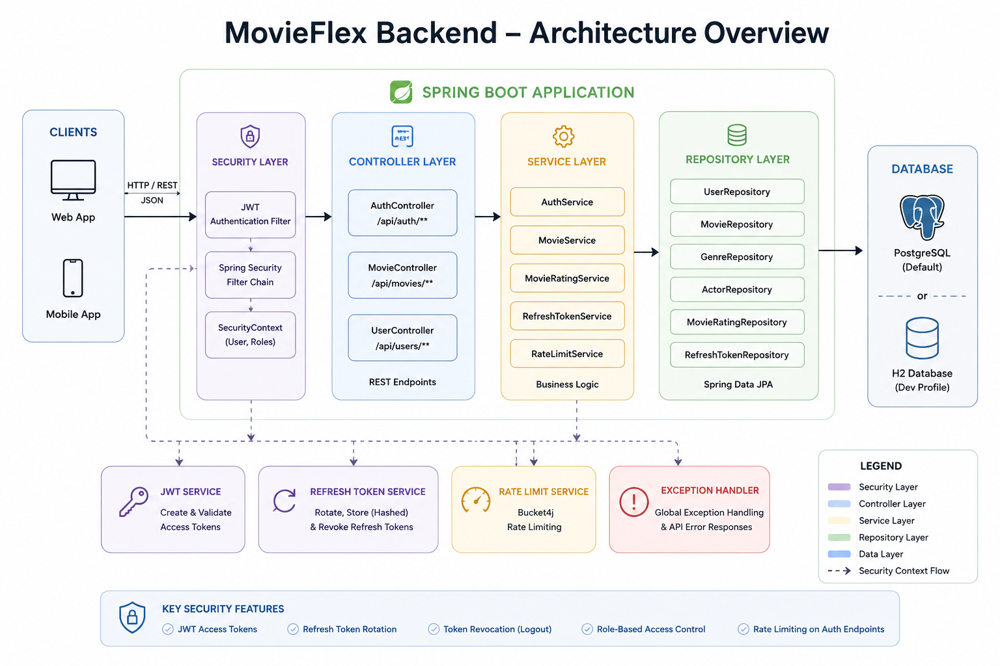
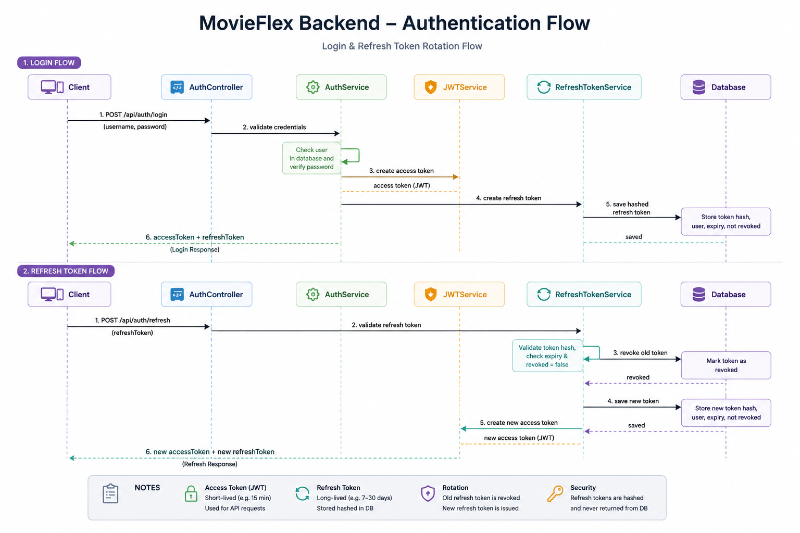
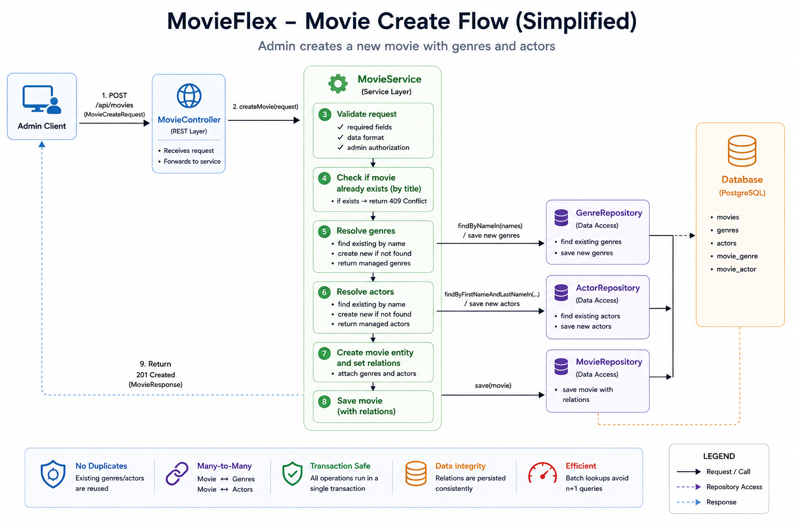

# MovieFlex Backend


MovieFlex is a Spring Boot REST API for managing a movie catalog with JWT authentication, refresh token rotation, role-based admin endpoints, movie ratings, and Docker-based PostgreSQL setup.

This project was built as a backend portfolio project to demonstrate practical Spring Boot, Spring Security, REST API design, relational database modeling, integration testing, and Docker deployment basics.

---

## Features

### Authentication & Security

- User registration and login
- JWT access token authentication
- Refresh token rotation
- Logout with refresh token revocation
- `/api/users/me` endpoint for authenticated user data
- Role-based access control
- Admin-only movie management
- Rate limiting for sensitive auth endpoints
- Consistent API error responses

### Movie API

- Public movie listing
- Movie details endpoint
- Search by title
- Search by genre
- Admin movie creation
- Admin movie deletion
- Genre and actor many-to-many handling
- Existing genres/actors are reused instead of duplicated

### Rating System

- Authenticated users can rate movies
- One rating per user per movie
- Re-rating updates the existing rating
- Average rating is calculated per movie
- Rating count is returned with movie data

### Documentation & Testing

- OpenAPI / Swagger UI
- Integration tests for auth, movies, ratings, and protected endpoints
- H2 dev profile with demo data
- PostgreSQL setup for default/Docker usage
- Docker Compose setup for backend + database

---

## Tech Stack

- Java 21
- Spring Boot 4
- Spring Security 7
- Spring Data JPA / Hibernate
- PostgreSQL
- H2 Database for dev/testing
- JWT with Nimbus encoder/decoder
- Bucket4j for rate limiting
- Springdoc OpenAPI / Swagger UI
- Maven
- Docker / Docker Compose

---

## Architecture Overview



---

## Authentication Flow



---

## Movie Creation Flow



---


---

## API Documentation

When the application is running, Swagger UI is available at:

```text
http://localhost:8080/swagger-ui.html
```

The raw OpenAPI JSON is available at:

```text
http://localhost:8080/v3/api-docs
```

Swagger includes the available controllers, request DTOs, response DTOs, and JWT bearer authentication support.

---

## API Overview

### Authentication

| Method | Endpoint | Auth | Description |
|---|---|---|---|
| POST | `/api/auth/register` | Public | Register a new user |
| POST | `/api/auth/login` | Public | Login and receive access/refresh tokens |
| POST | `/api/auth/refresh` | Public | Rotate refresh token and receive new tokens |
| POST | `/api/auth/logout` | Public | Revoke refresh token |
| GET | `/api/users/me` | Bearer Token | Get current authenticated user |

### Movies

| Method | Endpoint | Auth | Description |
|---|---|---|---|
| GET | `/api/movies` | Public | Get all movies |
| GET | `/api/movies/{movieName}` | Public | Get movie details |
| GET | `/api/movies/search?title=` | Public | Search movies by title |
| GET | `/api/movies/search?genre=` | Public | Search movies by genre |
| POST | `/api/movies` | ADMIN | Create a new movie |
| DELETE | `/api/movies/{movieId}` | ADMIN | Delete a movie |

### Ratings

| Method | Endpoint | Auth | Description |
|---|---|---|---|
| PUT | `/api/movies/{movieId}/rating` | Bearer Token | Create or update the current user's rating for a movie |

---

## Example Requests

### Register

```http
POST /api/auth/register
Content-Type: application/json

{
  "username": "eni",
  "password": "password123",
  "email": "adheni@example.com"
}
```

### Login

```http
POST /api/auth/login
Content-Type: application/json

{
  "username": "eni",
  "password": "password123"
}
```

Example response:

```json
{
  "accessToken": "eyJhbGciOiJIUzI1NiJ9...",
  "tokenType": "Bearer",
  "refreshToken": "9f3b4c2a-...",
  "user": {
    "username": "eni",
    "email": "adheni@example.com"
  }
}
```

### Get Current User

```http
GET /api/users/me
Authorization: Bearer <access-token>
```

### Create Movie

Requires an admin user.

```http
POST /api/movies
Authorization: Bearer <admin-access-token>
Content-Type: application/json

{
  "title": "Interstellar",
  "description": "A sci-fi movie about space, time and survival.",
  "imageUrl": "/images/interstellar.jpg",
  "duration": 169,
  "releaseYear": "2014",
  "genres": ["Sci-Fi", "Drama", "Adventure"],
  "actors": [
    {
      "firstName": "Matthew",
      "lastName": "McConaughey"
    },
    {
      "firstName": "Anne",
      "lastName": "Hathaway"
    }
  ]
}
```

### Rate Movie

```http
PUT /api/movies/1/rating
Authorization: Bearer <access-token>
Content-Type: application/json

{
  "ratingValue": 8
}
```

Example response:

```json
{
  "ratingValue": 8,
  "averageRating": 8.0,
  "ratingCount": 1
}
```

---

## Environment Variables

Create a `.env` file in the project root based on `.env.example`.

Example:

```env
DB_URL=jdbc:postgresql://localhost:5432/movieflex
DB_USERNAME=movieflex_user
DB_PASSWORD=movieflex_password

JWT_SECRET_KEY=replace-with-your-own-base64-secret
JWT_ACCESS_TOKEN_EXPIRATION_MINUTES=15
JWT_REFRESH_TOKEN_EXPIRATION_DAYS=10
```

The application expects `JWT_SECRET_KEY` to be Base64 encoded.

Example dev secret:

```env
JWT_SECRET_KEY=c2FsZXNwZWFraGlsbHJlZmVyc29mdGFmdGVyY291cmFnZWFsb25lZmVlbG1pc3Rha2U=
```


---

## Run with Docker

Docker Compose starts both the Spring Boot backend and a PostgreSQL database.

### 1. Clone the repository

```cmd
git clone <repository-url>
cd movieflex
```

### 2. Create `.env`

Windows CMD / PowerShell:

```cmd
copy .env.example .env
```

Then edit `.env` and set your values.

### 3. Start the application

```cmd
docker compose up --build
```

The backend will be available at:

```text
http://localhost:8080
```

Swagger UI:

```text
http://localhost:8080/swagger-ui.html
```

PostgreSQL is exposed on:

```text
localhost:5432
```

You can connect to it using:

```text
Host: localhost
Port: 5432
Database: movieflex
Username: value from DB_USERNAME
Password: value from DB_PASSWORD
```

### Stop containers

```cmd
docker compose down
```

### Stop containers and delete database volume

```cmd
docker compose down -v
```

---

## Run Locally with H2 Dev Profile

For quick local development without PostgreSQL, use the `dev` profile.

```cmd
mvn spring-boot:run "-Dspring-boot.run.profiles=dev"
```

This starts the application with:

- H2 in-memory database
- H2 console enabled
- Demo data from `data-dev.sql`
- Longer dev access token expiration

H2 Console:

```text
http://localhost:8080/h2-console
```

Default H2 connection:

```text
JDBC URL: jdbc:h2:mem:devdb
Username: sa
Password:
```

---

## Run Locally with PostgreSQL

If you have PostgreSQL installed locally, create a database named `movieflex`, configure `.env`, and run:

```cmd
mvn spring-boot:run
```

Default JDBC URL:

```text
jdbc:postgresql://localhost:5432/movieflex
```

You can override it with:

```env
DB_URL=jdbc:postgresql://localhost:5432/movieflex
```

---

## Running Tests

Run all tests:

```cmd
mvn test
```

The integration tests use the `dev` profile with H2 and demo data.

The test suite covers:

- User registration
- Login
- JWT-authenticated `/me` endpoint
- Refresh token rotation
- Logout / token revocation
- Public movie endpoints
- Admin-only movie creation/deletion
- Genre and actor relationship handling
- User movie ratings
- Average rating calculation
- Protected endpoint access rules

---

## Project Structure

```text
src/main/java/de/enricoprojects/movieflex
├── config
│   ├── JWTConfig
│   └── OpenApiConfig
├── controller
│   ├── AuthController
│   ├── MovieController
│   └── UserController
├── dto
│   ├── request/response DTOs
│   └── ApiErrorDTO
├── entity
│   ├── User
│   ├── Movie
│   ├── Genre
│   ├── Actor
│   ├── RefreshToken
│   └── MovieRating
├── exception
│   └── custom API exceptions
├── repository
│   └── Spring Data JPA repositories
├── security
│   └── JWT filter and security config
└── service
    ├── AuthService
    ├── JWTService
    ├── RefreshTokenService
    ├── MovieService
    ├── MovieRatingService
    └── RateLimitService
```

---

## Database Model Overview

```mermaid
erDiagram
    USER ||--o{ REFRESH_TOKEN : owns
    USER ||--o{ MOVIE_RATING : creates
    MOVIES ||-So{ MOVIE_RATING : receives

    MOVIES }o--o{ GENRE : has
    MOVIES }o--o{ ACTOR : features

    USER {
        long user_id
        string username
        string email
        string password
        string role
        dateTime created_at
        dateTime updated_at
    }

    MOVIES {
        long movie_id
        string title
        string description
        string image_url
        int duration
        string releaseYear
    }

    MOVIE_RATING {
        long rating_id
        int ratingValue
        datetime createdAt
        datetime updatedAt
    }

    REFRESH_TOKEN {
        long id
        string tokenHash
        datetime expiresAt
        boolean revoked
    }

    GENRE {
        long genre_id
        string name
    }

    ACTOR {
        long actor_id
        string first_name
        string last_name
    }
```

---

## Notes

This project is intended as a backend portfolio project and learning project. It focuses on practical implementation of:

- RESTful backend design
- Spring Security with JWT
- Refresh token lifecycle
- Role-based authorization
- JPA entity relationships
- DTO-based API responses
- Integration testing
- Docker-based local deployment
- OpenAPI documentation

For a real production environment, database migrations with Flyway or Liquibase would be recommended instead of relying only on Hibernate schema updates.

---

## Version

Current version:

```text
v1.0.0
```
